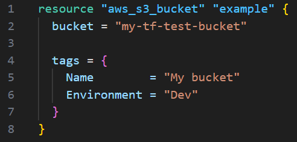
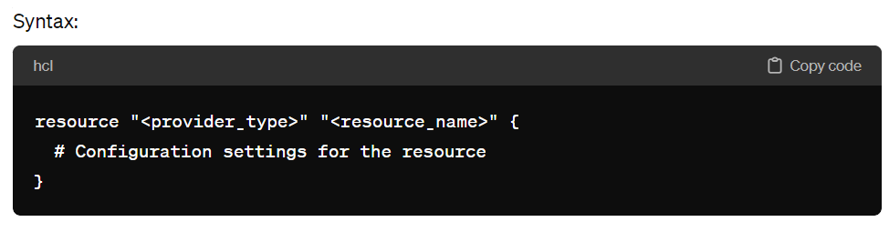
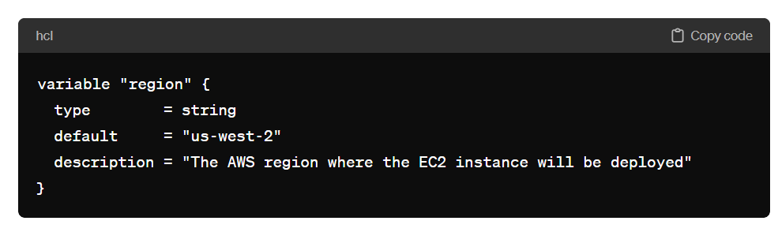

# Terraform: A Student's Quick Guide

## What is Terraform?

Terraform is an open-source infrastructure as code software tool created by HashiCorp. It allows users to define and provision data center infrastructure using a high-level configuration language known as HashiCorp Configuration Language (HCL) or optionally JSON.

## Why Terraform?

- **Infrastructure as Code (IaC):** Terraform enables the management of infrastructure through code, enhancing reproducibility, versioning, and collaboration among team members.

- **Multi-Cloud Support:** It supports multiple cloud providers like AWS, Azure, Google Cloud, and others, enabling users to deploy resources across different platforms using the same configuration.

- **Resource Graph:** Terraform builds an execution plan by analyzing the dependencies between resources, ensuring optimal resource provisioning and reducing deployment errors.

- **Immutable Infrastructure:** Terraform promotes the creation of immutable infrastructure, where changes are made by provisioning entirely new resources rather than modifying existing ones, enhancing reliability and stability.

- **Community Support:** With a large community of users and contributors, Terraform benefits from continuous improvement, extensive documentation, and a wealth of third-party modules and plugins.

## Terraform Blocks

1. **Provider Block:** Specifies the cloud provider or service used for resource provisioning. Example: `provider "aws" {}`.

Example: 

2. **Resource Block:** Defines the infrastructure resources to be provisioned, such as virtual machines, storage buckets, or networking components. Example: `resource "aws_instance" "example" {}`.

Example: 

- `<provider_type>`: Specifies the type of provider that Terraform should use to create the resource. This could be "aws", "azurerm", "google", etc., depending on the cloud provider you're working with.

- `<resource_name>`: This is a local name for the resource block, used to reference the resource within your Terraform configuration.

3. **Variable Block:** The variable block in Terraform is used to declare input variables that are used within your configuration. Variables allow you to parameterize your Terraform configurations, making them more dynamic and reusable across different environments or scenarios.

# Example:

Variable Block

- **Input Variables:** Used to parameterize Terraform configurations, allowing users to customize deployments based on different environments or requirements.

- **Variable Declaration:** Variables are declared using the `variable` block, specifying the variable name, type, and optional default value.

- **Variable Assignment:** Values for variables can be assigned using command-line flags, environment variables, or variable files.

- **Variable Interpolation:** Variables can be interpolated within the configuration using syntax like `${var.example}` to dynamically reference their values.
